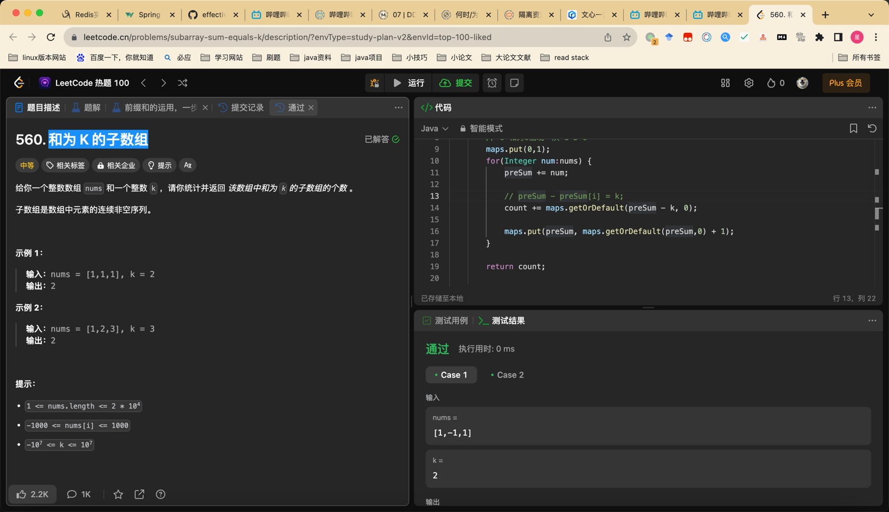

## Algorithm

day1 和为 K 的子数组
* 有负数
* 维护前缀和
* count+=maps.getOrDefault(preSum-k, 0);
* maps.put(preSum, maps.getOrDefault(preSum,0)+1)

day2 最大子数组和
* 动态规划
* 以当前数字结尾的最大和
* 所有最大和的最大

day03 合并区间
* 按照区间起始位置排序
* for循环遍历区间合并
* 情况1 直接添加
* 情况2 更新区间末位置为Max两者之一

day04 轮转旋转k次
* 取余k得到翻转次数 1 2 3 4 k=2 3 4 1 2
* 翻转整个数组 4 3 2 1
* 翻转前k个  3 4 1 2
* 翻转后k个 3 4 2 1

day05 除自身以外的乘积
* 模板 
```java
int k=1;
for() {
    res[i] = k;
    累乘积左侧
    k *= nums[i]
}
k = 1
for() {
    res[i] *= k;
    累乘积右侧
    k *= nums[i-1]
}
```


## Review

[nginx 入门](https://nginx.org/en/docs/beginners_guide.html)

## Tip

前端编写dockerfile，nginx直接部署然后负载后端，前端运行在容器

## Share
