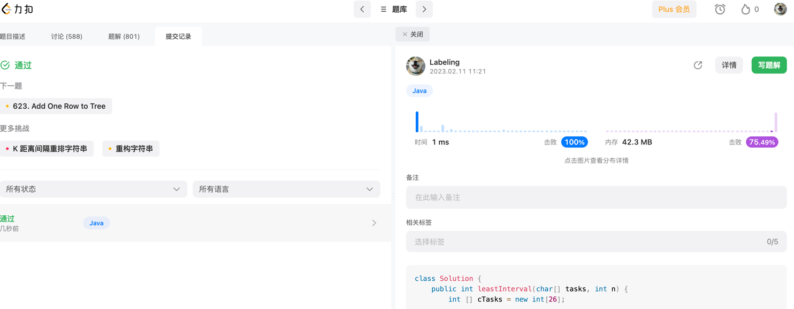

## Algorithm

* 模拟解法
* 情况1: (maxTasks-1) * (n + 1) + total
* total 任务数为max的个数
* 情况2: task.length max
## Review
[简单chat gpt介绍](https://lablab.ai/t/chatgpt-guide)

## Tip
mysql escape 支持自定义转义字符
```mysql
select * from user where user_name like '%_nihao%'
# 意思就是说/之后的_不作为通配符
select * from user where user_name like '%/_nihao%' escape '/'
```
mysql 连表更新
语法
```mysql
UPDATE T1, T2,
[INNER JOIN | LEFT JOIN] T1 ON T1.C1 = T2. C1
SET T1.C2 = T2.C2, 
    T2.C3 = expr
WHERE condition
```
[实战](https://www.cnblogs.com/eternityz/p/13985725.html)
```mysql
CREATE DATABASE IF NOT EXISTS empdb;

USE empdb;
-- create tables
CREATE TABLE merits (
                        performance INT(11) NOT NULL,
                        percentage FLOAT NOT NULL,
                        PRIMARY KEY (performance)
);

CREATE TABLE employees (
                           emp_id INT(11) NOT NULL AUTO_INCREMENT,
                           emp_name VARCHAR(255) NOT NULL,
                           performance INT(11) DEFAULT NULL,
                           salary FLOAT DEFAULT NULL,
                           PRIMARY KEY (emp_id),
                           CONSTRAINT fk_performance FOREIGN KEY (performance)
                               REFERENCES merits (performance)
);

-- insert data for merits table
INSERT INTO merits(performance,percentage)
VALUES(1,0),
      (2,0.01),
      (3,0.03),
      (4,0.05),
      (5,0.08);

-- insert data for employees table
INSERT INTO employees(emp_name,performance,salary)
VALUES('Mary Doe', 1, 50000),
      ('Cindy Minsu', 3, 65000),
      ('Sue Greenspan', 4, 75000),
      ('Grace Dell', 5, 125000),
      ('Nancy Johnson', 3, 85000),
      ('John Doe', 2, 45000),
      ('Lily Bush', 3, 55000);

# 更新前
select * from employees;

# 查询
select * from employees
                  LEFT JOIN merits m
                            on employees.performance = m.performance

# 更新
UPDATE employees em
    LEFT JOIN merits m
on em.performance = m.performance
SET em.salary = em.salary * m.percentage
    WHERE em.emp_id < 4
```
## Share